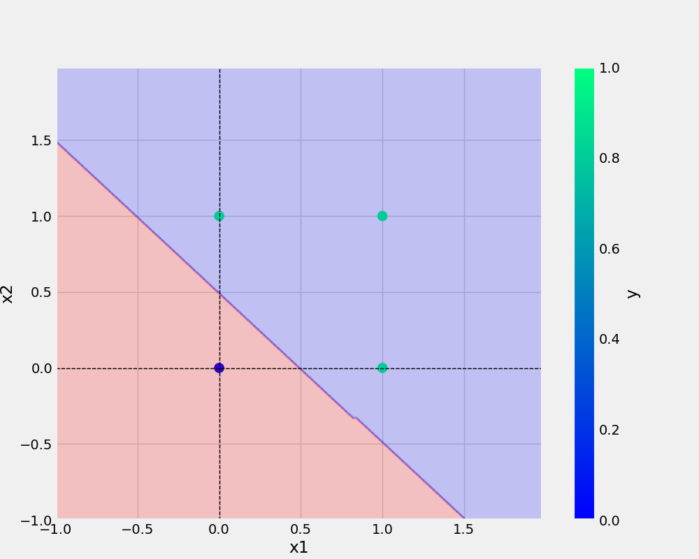

# Perceptron

# commands used:

''' bash

git add . 
git commit -m "docingstring updated"
git push origin main

'''

# Add URL
[Git Handbook](https://guides.github.com/introduction/git-handbook/)

# Add image
 